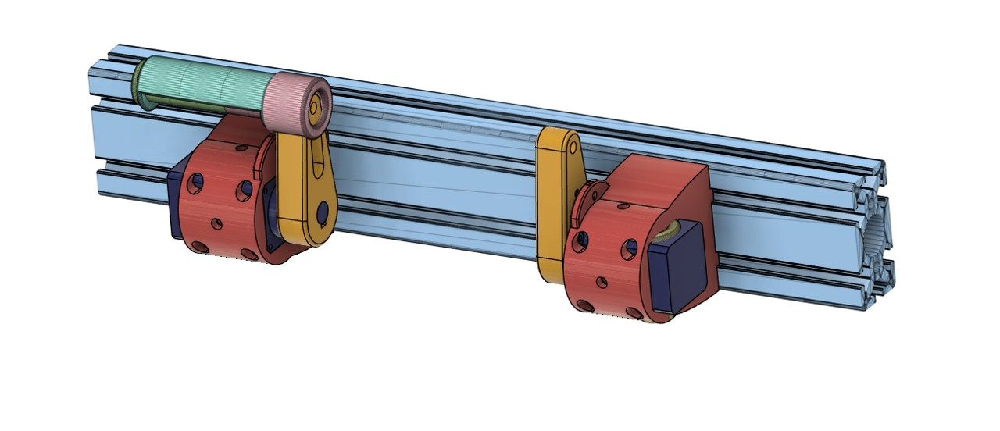
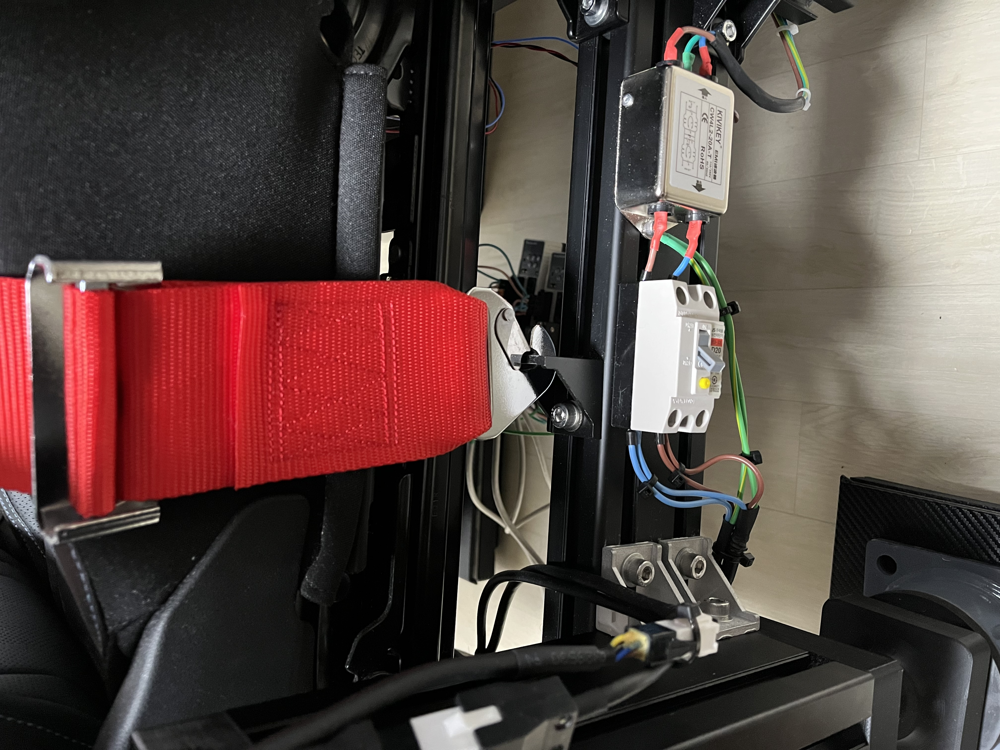
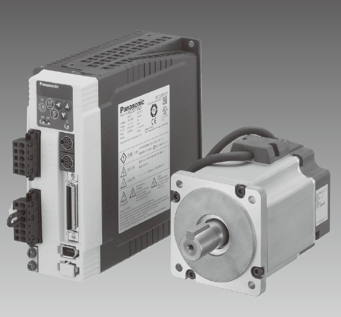
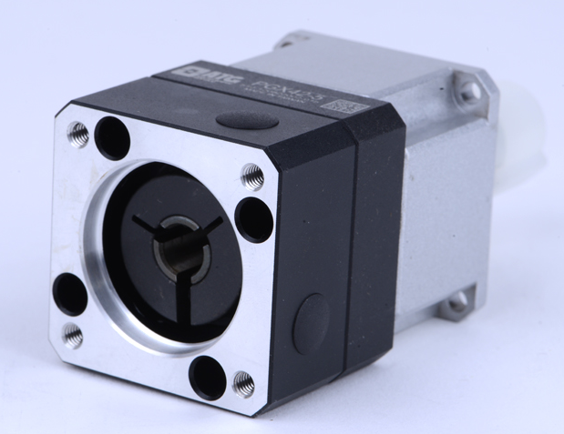
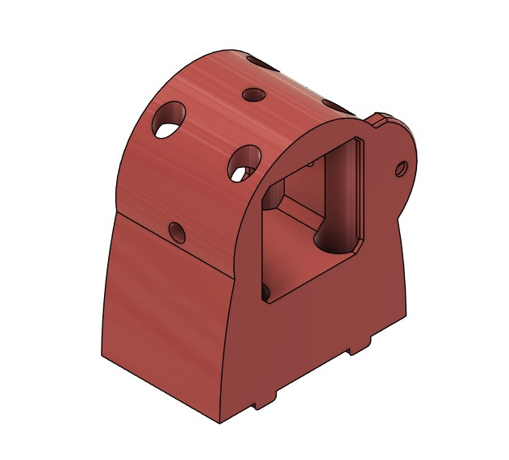
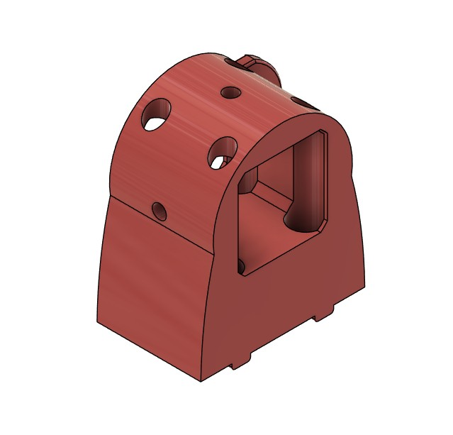
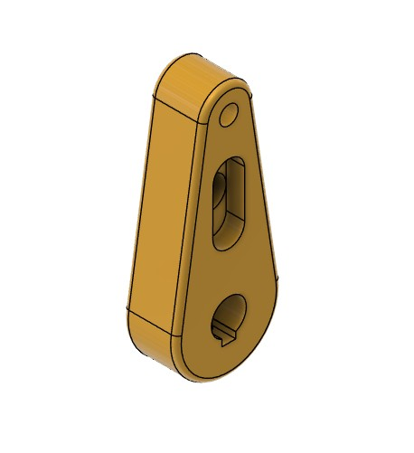
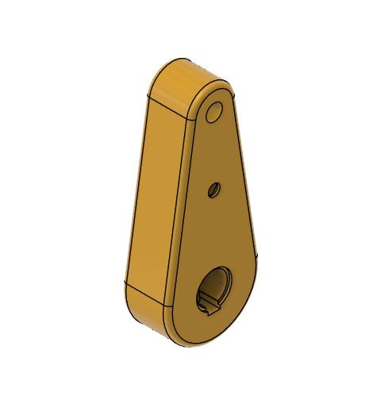
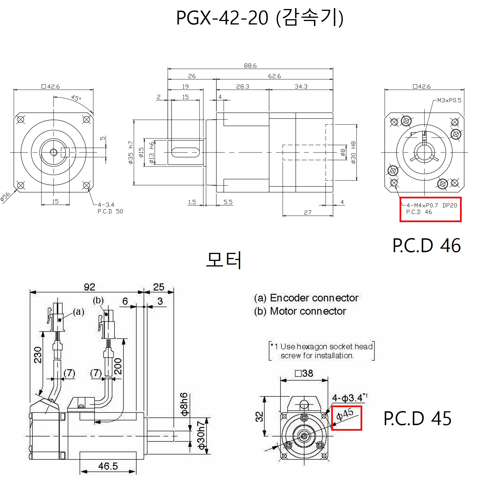

# Belt Tensioner (AC Servo Version)

AC Servo based belt tensioner for **Sim Racing**, built using a Panasonic Minas A4 servo system.

This project is based on the original DIY belt tensioner project:

https://www.simhubdash.com/diy-belt-tensionner/

---

# Overview

This project uses:

* Panasonic **Minas A4 100W AC Servo**
* **ATG PGX42-20** planetary reducer
* Arduino control
* Hall sensor for homing

The goal was to build a **quiet and responsive belt tensioner system** for SimHub.

---

---

# Hardware

## Main Components

| Component    | Model        |
| ------------ | ------------ |
| Servo Driver | MADDT1205    |
| Servo Motor  | MSMD012S1A   |
| Reducer      | ATG PGX42-20 |

---

# Arduino Wiring

| Function    | Motor 1 | Motor 2 | Servo I/O |
| ----------- | ------- | ------- | --------- |
| Pulse       | 9       | 10      | 4         |
| Direction   | 7       | 8       | 6         |
| Hall Sensor | 2       | 3       | -         |
| GND         | GND     | GND     | 41        |

---

# Servo I/O Pin Map

| Pin | Signal | Connection   |
| --- | ------ | ------------ |
| 3   | PULS1  | P24          |
| 4   | PULS2  | 0V (<- Arduino INPUT) |
| 5   | SIGN1  | P24          |
| 6   | SIGN2  | 0V (<- Arduino INPUT) |
| 7   | COM+   | P24          |
| 29  | SRV-ON | 0V           |
| 41  | COM-   | 0V           |

---

# Servo Drive Parameters

| Parameter | Description                 | Value |
| --------- | --------------------------- | ----- |
| Pr02      | Control Mode                | 0     |
| Pr04      | Disable Over-travel Input   | 1     |
| Pr40      | Command Pulse Input         | 0     |
| Pr42      | Pulse Input Mode            | 3     |
| Pr43      | Pulse Input Inhibition      | 1     |
| Pr4E      | Counter Clear Mode          | 2     |
| Pr4B      | Electronic Gear Denominator | 150   |

---

# Part List

|   Name              | EA | Site | Note |
| ------------------- | ------ | --- | ------ |
| Arduino Uno  | 1 |  [Buy](https://smartstore.naver.com/misoparts/products/9379052866)|  
| Arduino Uno Shild | 1 | [Buy](https://smartstore.naver.com/misoparts/products/10603168121?NaPm=ct%3Dmn7drck7%7Cci%3Dcheckout%7Ctr%3Dppc%7Ctrx%3Dnull%7Chk%3D3a5278cd1bf0568a4d11e4eadbc10e0cae402130)|  
| A3144 Hall Sensor | 2 | [Buy](https://smartstore.naver.com/misoparts/products/7329734570?NaPm=ct%3Dmn7dpx2u%7Cci%3Dcheckout%7Ctr%3Dppc%7Ctrx%3Dnull%7Chk%3Da3cfd6375822489dd6bc4980d3f5e7baf3b7b32b) |  
| C1815 TR | 2 | [Buy](https://smartstore.naver.com/misoparts/products/11061354807?nl-query=c1815&nl-ts-pid=jNRU%2BdqosZrn%2FEksWhw-187553&NaPm=ct%3Dmn7e0o5k%7Cci%3Da570d6e8258bb65872f80c7d444928dd216ad8e6%7Ctr%3Dsls%7Csn%3D1956020%7Chk%3D9312de2891ce2c50cb21488a5161755a40be8f52)
| Magnet 6X3 | 2 |  [Buy](https://smartstore.naver.com/3hl) | 네오디움 자석
| 4Point Belt | 1 | [Buy](https://item.taobao.com/item.htm?id=839255746083&mi_id=00004S58StZul3NskVfQ029lyz4kKTe90rmb6Bs6klbWzL0&spm=tbpc.boughtlist.suborder_itempic.d839255746083.d3182e8dDrrSKg)  | 안전밸트
| Die-Casting Bracket for Profile 40X40 | 2 |  | 안전벨트 걸이  |
| M4X10 | 8 |  | Motor ↔ 감속기 체결용 볼트 (여유분있게 구매) |
| M5X15 | 8 |  | Motor 3D Print 체결용 볼트 (여유분있게 구매) |
| M6X110 | 2 |  | 안전벨트 체결용 볼트 (여유분있게 구매) |
| M8X15 | 2 |  | 다이닝캐스팅 고정용 볼트 (여유분있게 구매)  |
| M6 NUT | 2 |  | 안전벨트 체결용 너트 (여유분있게 구매)  |
| 40 T Nut | 2 |  | 다이닝캐스팅 고정용 T Nut (여유분있게 구매)  |

---

# 3D Print

| Name |  EA  |
| --- |  ------ |
| 

  |  1EA
| 

   |  1EA
| 

   |   1EA
| 

   |  1EA

# Arduino Source Check List

| Name | Value | 
| --- | ------ |
| totalWorkingRange | 1500 |
| stepper1_directionPin |  7 |
| stepper1_enablePin  | 11 |
| stepper1_hallSensorPin |  2 |
| stepper2_directionPin | 8 |
| stepper2_enablePin | 13 |
| stepper2_hallSensorPin | 3 |

## 🇰🇷 아두이노 테스트 주의사항
초기 실행시 const bool sensorTestMode = false; 값을 True로 변경하여
자석을 감지시켜 센서가 정상적으로 동작하는지 확인한다.

---

## 🇺🇸 Arduino Test Notice

During the initial run, change the value of const bool sensorTestMode = false; to true, 
then trigger the magnet to verify that the sensor is operating correctly.

---

# Assembly Notes

## 🇰🇷 조립 주의사항

- 감속기 P.C.D : 46 mm  
- 모터 P.C.D : 45 mm  

두 부품의 P.C.D 차이가 **1 mm** 있어 볼트 구멍이 정확히 맞지 않습니다.  

따라서 모터쪽 **M4 볼트가 들어갈 수 있도록 드릴로 구멍을 확장해야 합니다.**  

저는 약 **Ø6.5 mm** 정도로 구멍을 확장하여 사용했습니다.

---

## 🇺🇸 Assembly Notes

- Gearbox P.C.D: 46 mm  
- Motor P.C.D: 45 mm  

Because there is a **1 mm difference in the P.C.D**, the bolt holes do not align perfectly.  

Therefore, **the holes need to be enlarged with a drill** so that the M4 bolts on the motor side can fit.  

In my case, I enlarged the holes to approximately **Ø6.5 mm**.

---

# Credits

Original project inspiration:

DIY Belt Tensioner
https://www.simhubdash.com/diy-belt-tensionner/
