# Belt Tensioner (AC Servo Version)

AC Servo based belt tensioner for **Sim Racing**, built using a Panasonic Minas A4 servo system.

This project is based on the original DIY belt tensioner project:

https://www.simhubdash.com/diy-belt-tensionner/

---

# Overview

This project uses:

* Panasonic **Minas A4 100W AC Servo**
* **ATG PGX42-20** planetary reducer
* Arduino control
* Hall sensor for homing

The goal was to build a **quiet and responsive belt tensioner system** for SimHub.

---

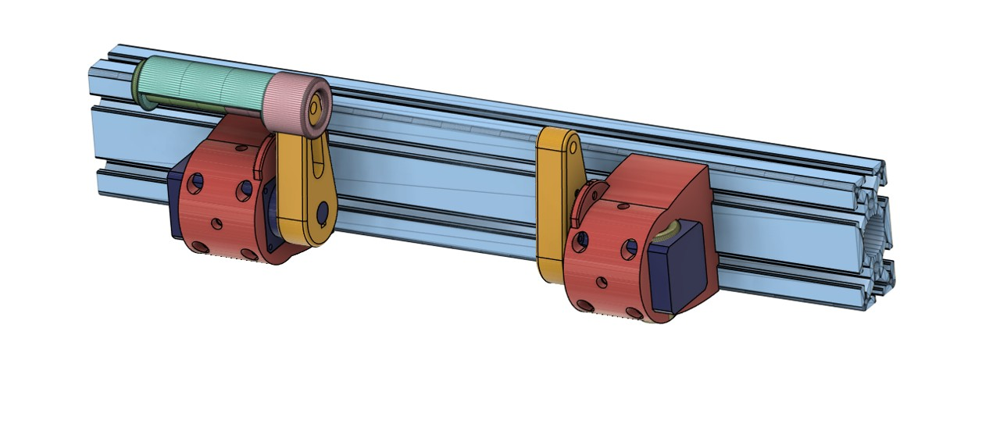

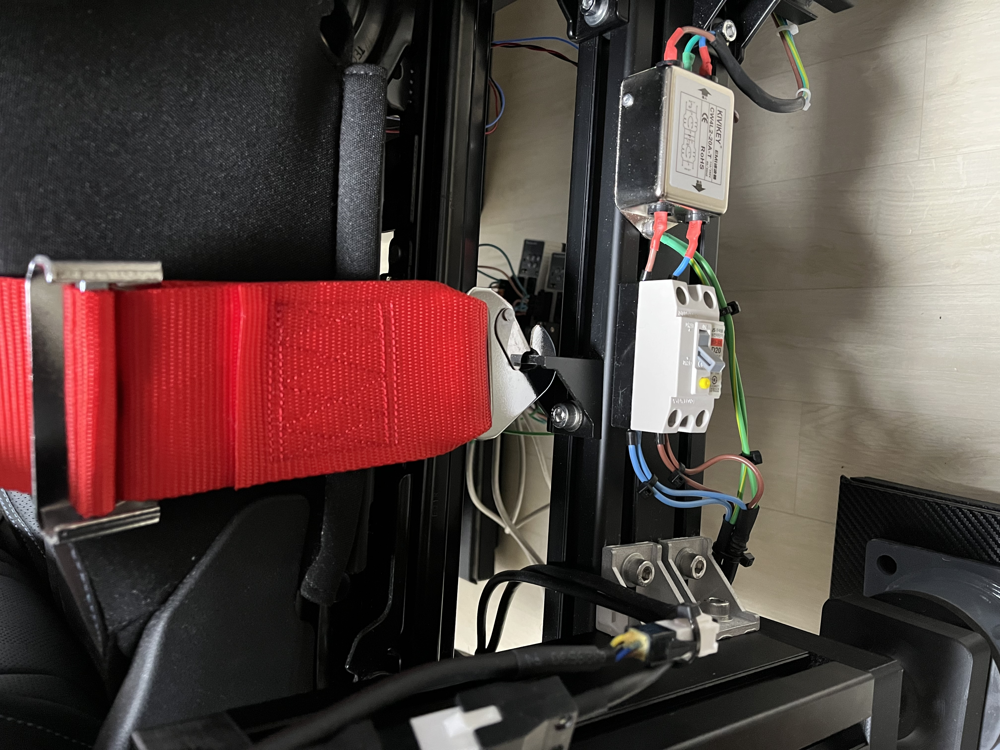

---

# Hardware

## Main Components

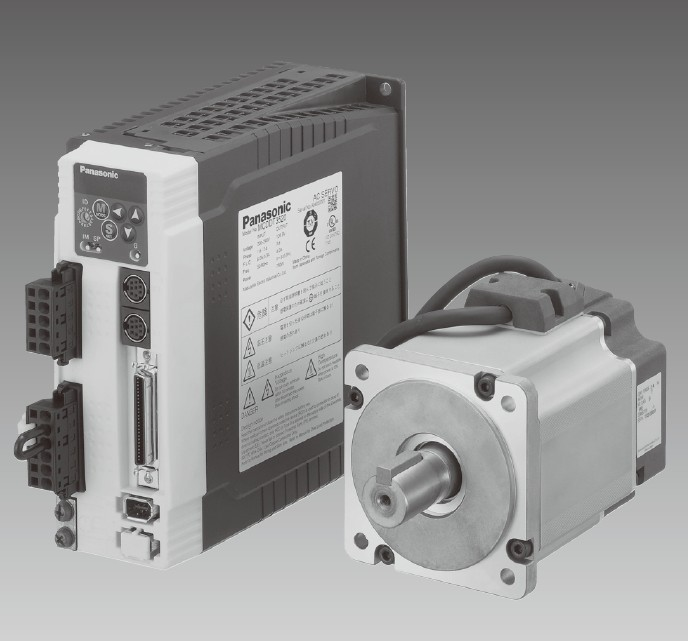
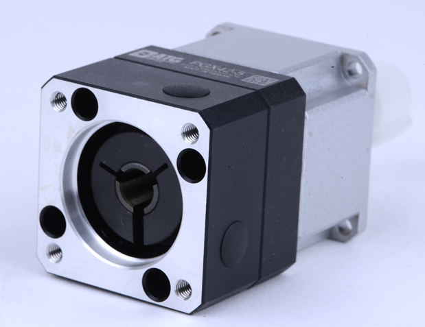

| Component    | Model        |
| ------------ | ------------ |
| Servo Driver | MADDT1205    |
| Servo Motor  | MSMD012S1A   |
| Reducer      | ATG PGX42-20 |

---

# Arduino Wiring (Board Type)

| Function    | Motor 1 | Motor 2 | Servo I/O |
| ----------- | ------- | ------- | --------- |
| Pulse       | 9       | 10      | 4         |
| Direction   | 7       | 8       | 6         |
| Hall Sensor | 2       | 3       | -         |
| 24V+        |         |         | 3,5       |

# Arduino Wiring (PCB Type Type / I/O(3,4,5,6))

| Function    | Motor 1 | Motor 2 | Servo I/O |
| ----------- | ------- | ------- | --------- |
| Pulse       | 9       | 10      | 4         |
| Direction   | 7       | 8       | 6         |
| Hall Sensor | 2       | 3       | -         |
| 24V+        |         |         | 3,5       |

# Arduino Wiring (PCB Type Type / I/O(1,4,2,6))

| Function    | Motor 1 | Motor 2 | Servo I/O |
| ----------- | ------- | ------- | --------- |
| Pulse       | 9       | 10      | 4         |
| Direction   | 7       | 8       | 6         |
| Hall Sensor | 2       | 3       | -         |
| 24V+        |         |         | 1,2       |

---

# Servo I/O Pin Map

| Pin | Signal | Connection   |
| --- | ------ | ------------ |
| 3   | PULS1 / OPC1  | 24V+                  |
| 4   | PULS2         | 0V (<- Arduino INPUT) |
| 5   | SIGN1 / OPC2  | 24V+                  |
| 6   | SIGN2         | 0V (<- Arduino INPUT) |
| 7   | COM+          | 24V+                  |
| 29  | SRV-ON        | 0V                    |
| 41  | COM-          | 0V                    |

---

# Servo Drive Parameters

| Parameter | Description                 | Value |
| --------- | --------------------------- | ----- |
| Pr02      | Control Mode                | 0     |
| Pr04      | Disable Over-travel Input   | 1     |
| Pr40      | Command Pulse Input         | 0     |
| Pr42      | Pulse Input Mode            | 3     |
| Pr43      | Pulse Input Inhibition      | 1     |
| Pr4E      | Counter Clear Mode          | 2     |
| Pr4B      | Electronic Gear Denominator | 150   |

---

# Part List (모든전장품은 여유분을 꼭 가지고 사세요.) 

|   Name              | EA | Site | Note | 
| ------------------- | ------ | --- | ------ |
| PCB  | 1 |  [Buy](https://github.com/heavy2119/Belt-tensioner-AC-Servo-/tree/main/PCB)| https://cart.jlcpcb.com/ 주문
| Arduino Nano  | 1 |  [Buy](https://smartstore.naver.com/misoparts/products/9353232362)| 
| Arduino Nano 소켓  | 1 |  [Buy](https://smartstore.naver.com/misoparts/products/5685496972)| 
| PCB 소켓  | 1 |  [Buy](https://ko.aliexpress.com/item/1005010243767312.html?spm=a2g0o.productlist.main.2.1068RCCJRCCJlP&algo_pvid=f67593e5-35dd-4ec8-bdc2-bcfdae44dea6&algo_exp_id=f67593e5-35dd-4ec8-bdc2-bcfdae44dea6-1&pdp_ext_f=%7B%22order%22%3A%225%22%2C%22eval%22%3A%221%22%2C%22fromPage%22%3A%22search%22%7D&pdp_npi=6%40dis%21KRW%214040%214040%21%21%212.58%212.58%21%40212e520f17812412080348024eb037%2112000051657823109%21sea%21KR%211744487115%21X%211%210%21n_tag%3A-29919%3Bd%3A399f8ce5%3Bm03_new_user%3A-29895&curPageLogUid=9mFixbuTZLvJ&utparam-url=scene%3Asearch%7Cquery_from%3A%7Cx_object_id%3A1005010243767312%7C_p_origin_prod%3A)|  KF301-5.0-2P 
| PCB 소켓  | 2 |  [Buy](https://ko.aliexpress.com/item/1005010243767312.html?spm=a2g0o.productlist.main.2.1068RCCJRCCJlP&algo_pvid=f67593e5-35dd-4ec8-bdc2-bcfdae44dea6&algo_exp_id=f67593e5-35dd-4ec8-bdc2-bcfdae44dea6-1&pdp_ext_f=%7B%22order%22%3A%225%22%2C%22eval%22%3A%221%22%2C%22fromPage%22%3A%22search%22%7D&pdp_npi=6%40dis%21KRW%214040%214040%21%21%212.58%212.58%21%40212e520f17812412080348024eb037%2112000051657823109%21sea%21KR%211744487115%21X%211%210%21n_tag%3A-29919%3Bd%3A399f8ce5%3Bm03_new_user%3A-29895&curPageLogUid=9mFixbuTZLvJ&utparam-url=scene%3Asearch%7Cquery_from%3A%7Cx_object_id%3A1005010243767312%7C_p_origin_prod%3A)|  KF301-5.0-3P 
| PCB 소켓  | 2 |  [Buy](https://ko.aliexpress.com/item/1005010243767312.html?spm=a2g0o.productlist.main.2.1068RCCJRCCJlP&algo_pvid=f67593e5-35dd-4ec8-bdc2-bcfdae44dea6&algo_exp_id=f67593e5-35dd-4ec8-bdc2-bcfdae44dea6-1&pdp_ext_f=%7B%22order%22%3A%225%22%2C%22eval%22%3A%221%22%2C%22fromPage%22%3A%22search%22%7D&pdp_npi=6%40dis%21KRW%214040%214040%21%21%212.58%212.58%21%40212e520f17812412080348024eb037%2112000051657823109%21sea%21KR%211744487115%21X%211%210%21n_tag%3A-29919%3Bd%3A399f8ce5%3Bm03_new_user%3A-29895&curPageLogUid=9mFixbuTZLvJ&utparam-url=scene%3Asearch%7Cquery_from%3A%7Cx_object_id%3A1005010243767312%7C_p_origin_prod%3A)|  KF301-5.0-6P 
| 드라이버 I/O 케이블  | 2 |  [Buy](https://item.taobao.com/item.htm?app=chrome&bxsign=scdEIWKuESER8U5xnxy5UypX-h9gqrIa_2F175ht3pZH9qLZWTz3YafUSfLywZOiA0oqQpw09bGaAfb-tYzo6OODquXGpvgk2ZA0gx9qjqlnD0h43fJwyP7B0J3GScm1XQQIiNPralhQOj9KYJ6N0E22g&cpp=1&id=1012712594796&price=26&shareUniqueId=36367171871&share_crt_v=1&shareurl=true&short_name=h.Rl4IKiGIObKHH8y&sourceType=item&sp_tk=OFFqc2czUGRxNjQ%3D&spm=a2159r.13376460.0.0&suid=A8C2DA91-790D-4BFF-ACCE-9807E8DE1486&tbSocialPopKey=shareItem&tk=8Qjsg3Pdq64&un=9c9e045560dbe16fea052d3cdb5a861d&un_site=0&ut_sk=1.aRGYbe0Ep7UDAL91ORp3HC68_21380790_1781250425722.Copy.1&wxsign=tbwfndciaQd07XNwYEnhQE4ox4YsgfON4hZoU8MK4EWJGwDRfmfvJldFBZY_CJdsn4sf7SqwzJWIv1rBnVry9NsLxKNTje1_jLv8igOgFUu-mwpLkwHzlsF3XkwMXb7fm_Y7kdBhRzVecFMBmRdAlelxQ&sku_properties=122216547%3A65793)| 松下X4控制线 << 항목 선택 주문
| 드라이버 엔코더,전원 케이블  | 2 |  [Buy](https://item.taobao.com/item.htm?app=chrome&bxsign=scd854Rx-E0UsZbZ0Jb33VwUZk728I5dZNzpTZTr_qHxpradlsdhNXh0-GKyzgpd0e6tv2PnbWnrVTkwWxpzbNX7lfQoaPBPo2d1erPkUNyHz4pTgf8BYi5j0NuB7cgjh7QaZqHsTb4kYqnxaSoDuofdw&cpp=1&id=1043514073575&price=10&shareUniqueId=36367592067&share_crt_v=1&shareurl=true&short_name=h.Rl4tnGXgbVI2Fqo&sourceType=item&sp_tk=Y3dnY2czUGVUS24%3D&spm=a2159r.13376460.0.0&suid=26C268D0-D7C8-499C-951C-13910665D847&tbSocialPopKey=shareItem&tk=cwgcg3PeTKn&un=9c9e045560dbe16fea052d3cdb5a861d&un_site=0&ut_sk=1.aRGYbe0Ep7UDAL91ORp3HC68_21380790_1781250425722.Copy.1&wxsign=tbwIxyAlggn0_d-Uq7_u4iOvd2ufymcAFcFlKMs2VWNfPE4oNQgALaY2BaKg4zCb3G5o7heMBy373zOoWHSZAe0RMrb2AQvGCaWy2BxBj8PE4AT7YNQmTVE-cUuJpjE4gbDLoZkKul4ot9Cexcl38BXkw)| 松下A4A5编码器线+动力线一套 << 항목 선택 주문
| 12 or 24V SMPS | 1 | [Buy](https://smartstore.naver.com/jooyontns/products/498258307?NaPm=ct%3Dmnb3725c%7Cci%3Db115b538f9efb45f20853d6a7b5da50d2f6fc92a%7Ctr%3Dslsl%7Csn%3D397527%7Chk%3De71384e42039656a006bbbafc72d1c25b0a0abc1&nl-au=1c1a04d1ec8048ceb3881a3d8997af97&nl-query=24V+SMPS)|  
| A3144 Hall Sensor | 2 | [Buy](https://smartstore.naver.com/misoparts/products/7329734570?NaPm=ct%3Dmn7dpx2u%7Cci%3Dcheckout%7Ctr%3Dppc%7Ctrx%3Dnull%7Chk%3Da3cfd6375822489dd6bc4980d3f5e7baf3b7b32b) |  원점 감지용
| C1815 TR | 4 | [Buy](https://smartstore.naver.com/misoparts/products/11061354807?nl-query=c1815&nl-ts-pid=jNRU%2BdqosZrn%2FEksWhw-187553&NaPm=ct%3Dmn7e0o5k%7Cci%3Da570d6e8258bb65872f80c7d444928dd216ad8e6%7Ctr%3Dsls%7Csn%3D1956020%7Chk%3D9312de2891ce2c50cb21488a5161755a40be8f52)
| 저항 1k | 8 | [Buy](https://smartstore.naver.com/misoparts/products/12929684410) | 2K 저항이 필요, 1K 2개 직렬사용
| 저항 1K ~ 4.7k | 2 | [Buy](https://smartstore.naver.com/misoparts/products/12929684410) | 평균 4.7K옴을 사용하나, 환경에 따라 틀림 / 풀업 저항 사용(노이즈억제)
| 전선 AWG24 X 8C | 1 | [Buy](https://smartstore.naver.com/ctkmall/products/9391403956?nl-query=8c%20%EC%BC%80%EC%9D%B4%EB%B8%94&nl-ts-pid=jNU6tdqVJ5T11XiMkxl-403131&frm=NVSCPSI&NaPm=ci%3DjNU6tdqVJ5T11XiMkxl-403131%7Cct%3Dmn855jdp%7Ctr%3Dnsls%7Csn%3D216556%7Chk%3D34b4b116794e805bc91e1e1ad1556970d0c50f80)| 10미터 정도?
| Magnet 6X3 | 2 |  [Buy](https://smartstore.naver.com/3hl) | 네오디움 자석
| 4Point Belt | 1 | [Buy](https://item.taobao.com/item.htm?id=839255746083&mi_id=00004S58StZul3NskVfQ029lyz4kKTe90rmb6Bs6klbWzL0&spm=tbpc.boughtlist.suborder_itempic.d839255746083.d3182e8dDrrSKg)  | 안전밸트
| Die-Casting Bracket for Profile 40X40 | 2 |  | 안전벨트 걸이  |
| M4X10 | 8 |  | Motor ↔ 감속기 체결용 볼트 (여유분있게 구매) |
| M5X15 | 8 |  | Motor 3D Print 체결용 볼트 (여유분있게 구매) |
| M6X110 | 2 |  | 안전벨트 체결용 볼트 (여유분있게 구매) |
| M8X15 | 8 |  | 다이닝캐스팅 고정용 볼트 (여유분있게 구매)  |
| M6 NUT | 2 |  | 안전벨트 체결용 너트 (여유분있게 구매)  |
| 40 T Nut | 2 |  | 다이닝캐스팅 고정용 T Nut (여유분있게 구매)  |

---

# 3D Print

| Name |  EA  | Note |
| --- |  ------ |------ |
| 
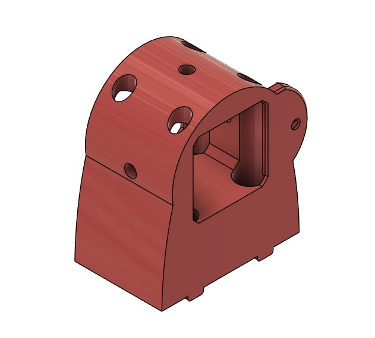
  |  1EA  |  ATG PGX42-20 전용 (내경 43mm)
| 
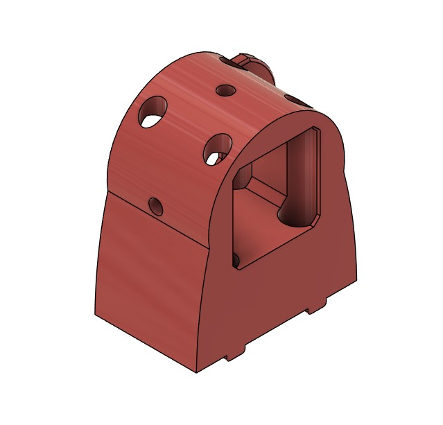
   |  1EA |  ATG PGX42-20 전용 (내경 43mm)
| 

  |  1EA  |   (내경 42.5mm)
| 

   |  1EA |   (내경 42.5mm)
| 
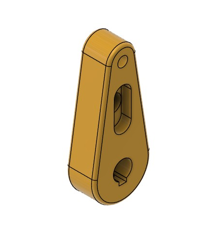
   |   1EA
| 
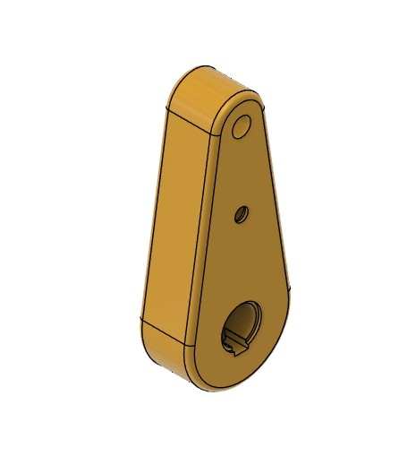
   |  1EA
| 
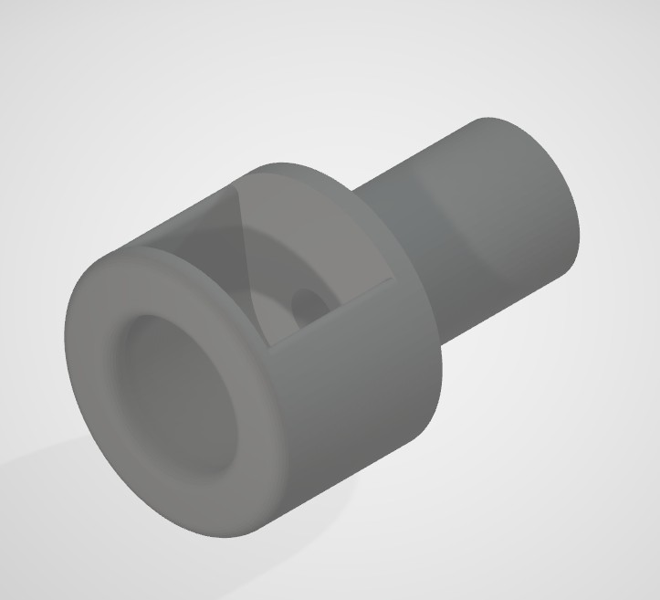
   |  1EA | By https://www.simhubdash.com/diy-belt-tensionner/
| 
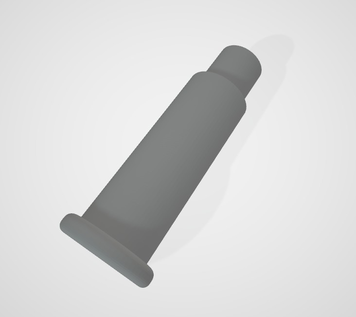
   |  1EA | By https://www.simhubdash.com/diy-belt-tensionner/
| 
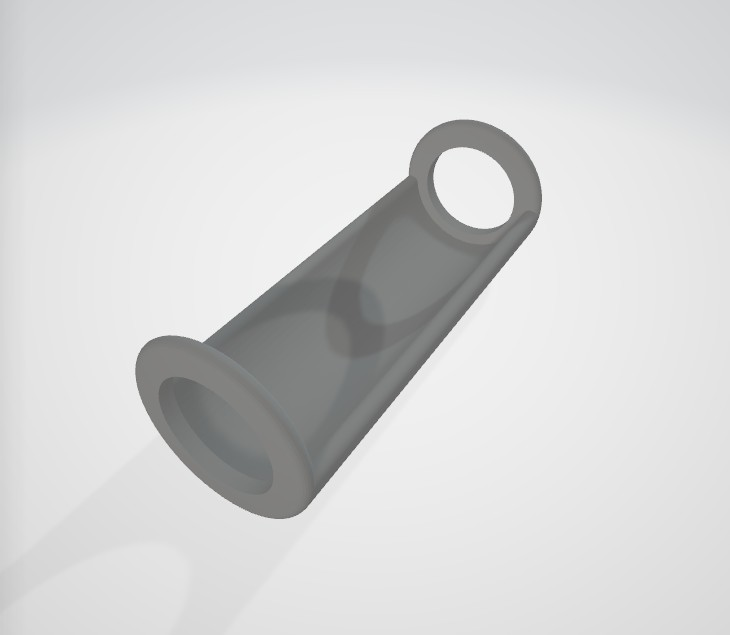
   |  1EA | By https://www.simhubdash.com/diy-belt-tensionner/

# Arduino Source Check List

| Name | Value | 
| --- | ------ |
| totalWorkingRange | 1500 |
| stepper1_directionPin |  7 |
| stepper1_enablePin  | 11 |
| stepper1_hallSensorPin |  2 |
| stepper2_directionPin | 8 |
| stepper2_enablePin | 13 |
| stepper2_hallSensorPin | 3 |

## 🇰🇷 아두이노 테스트 주의사항
초기 실행시 const bool sensorTestMode = false; 값을 True로 변경하여
자석을 감지시켜 센서가 정상적으로 동작하는지 확인한다.

정상 동작 확인후 true로 변경한다

이후 심허브에서 캘리브레이션을 실행하면 아래의 동영상과 같이
초기화가 되어야 한다

주의 : 절대 리그에 장착한 상태에서 테스트 하지말고 바닥에 두고
테스트 할것. 초기화 불가시 arm이 파손될수 있음

---

## 🇺🇸 Arduino Test Notice

During the initial run, change the value of const bool sensorTestMode = false; to true, 
then trigger the magnet to verify that the sensor is operating correctly.

---

# Assembly Notes

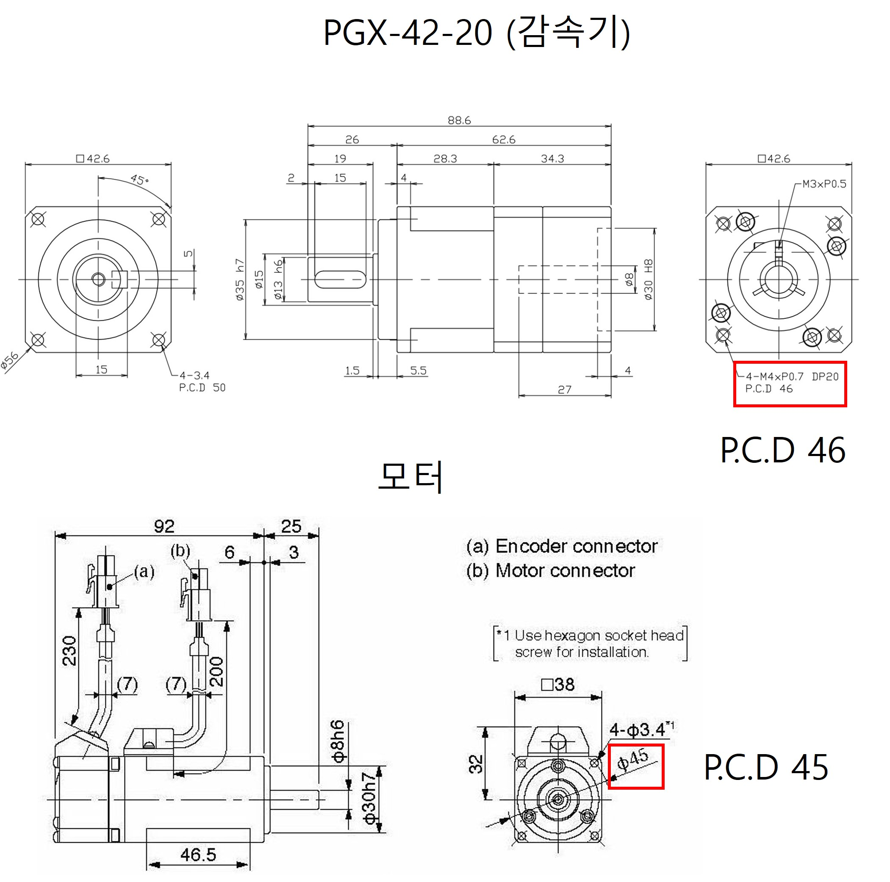

## 🇰🇷 조립 주의사항

- 감속기 P.C.D : 46 mm  
- 모터 P.C.D : 45 mm  

두 부품의 P.C.D 차이가 **1 mm** 있어 볼트 구멍이 정확히 맞지 않습니다.  

따라서 모터쪽 **M4 볼트가 들어갈 수 있도록 드릴로 구멍을 확장해야 합니다.**  

저는 약 **Ø6.5 mm** 정도로 구멍을 확장하여 사용했습니다.

---

## 🇺🇸 Assembly Notes

- Gearbox P.C.D: 46 mm  
- Motor P.C.D: 45 mm  

Because there is a **1 mm difference in the P.C.D**, the bolt holes do not align perfectly.  

Therefore, **the holes need to be enlarged with a drill** so that the M4 bolts on the motor side can fit.  

In my case, I enlarged the holes to approximately **Ø6.5 mm**.

---

# Credits

Original project inspiration:

DIY Belt Tensioner
https://www.simhubdash.com/diy-belt-tensionner/
